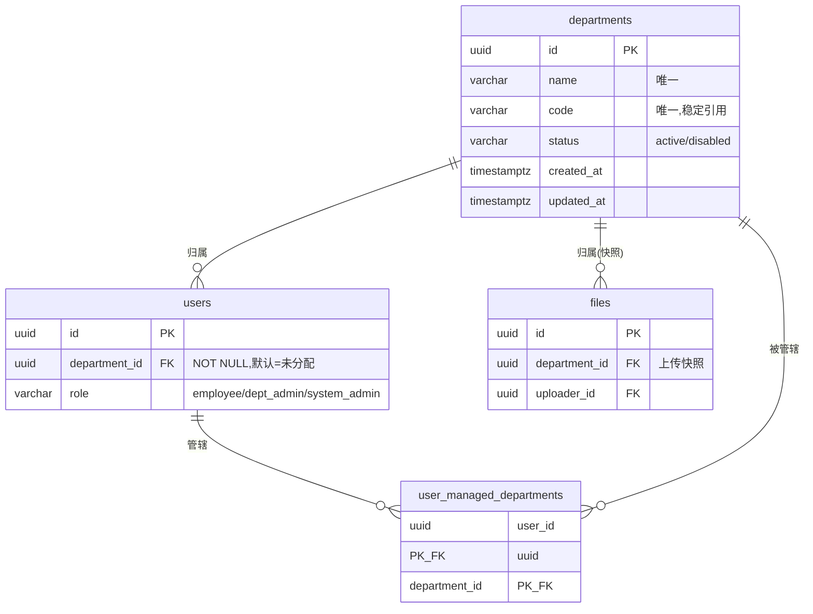

# 部门化审核与入库准入 — 变更设计 spec

- 版本：v1.0
- 日期：2026-06-23
- 状态：待评审（设计已与产品方对齐）
- 关联文档：
  - `需求文档/01_PRD_产品需求文档.md` §6.2 权限、§6.4 状态机、§6.8 RAGFlow 同步
  - `需求文档/05_DATABASE_API_SPEC_数据库与API规范.md` §1 表、§2 状态机、§3 API
  - `docs/spark/2026-06-04-p0-implementation-supplement.md`
  - `docs/quality/definition-of-done.md`（完成门）

---

## 1. 背景与问题

现有系统已埋了"部门"与"可见性"的字段，但**全链路零消费**，导致"分部门治理"在产品上落空：

- 角色是扁平三角色 `employee / knowledge_admin / system_admin`（`backend/app/core/permissions.py:13`），`require_role` 只判角色，无任何部门维度的数据隔离。
- `users.department`（`backend/app/modules/user/models.py:50`）、`files.department`（`backend/app/modules/document/models.py:91`）均为可空自由文本，无组织表、无外键。
- 注册采集部门为自由文本（`backend/app/modules/auth/schemas.py:12`），上传时把上传人部门**快照**进文件（`backend/app/modules/document/service.py:183`）。
- `department` 唯一被消费处是同步时写进 RAGFlow 元数据做标注（`backend/app/modules/ragflow/service.py:831`），不参与任何鉴权。
- 审核无部门隔离：`approve_file` / `reject_file` 仅 `_require_admin`（`backend/app/modules/review/service.py:533`、`:602`），待审清单不按部门过滤（`:469`）。任意管理员可审任意部门文件、可自审。
- `files.visibility`（`private/department/company`，`backend/app/modules/document/models.py:32`）仅在上传时校验取值（`backend/app/modules/document/service.py:136`），**无任何读取鉴权消费**，是死字段。
- 去重为 per-uploader（`backend/app/modules/document/service.py:141`），跨用户相同文档不去重。

## 2. 目标与非目标

### 2.1 目标
- 让"分部门上传 → 对应部门管理员审核 → 入库"真正成立：**部门作为审核路由 / 数据隔离维度**。
- 角色精简为两类管理身份：**部门管理员**与**超级管理员**，职责清晰。
- 把"入库准入条件"显式化、补齐缺口（自审防护、跨用户去重）。

### 2.2 关键业务前提（与产品方确认）
- **部门不决定入库目标库**。所有审核通过的文件**统一进入公司库**，供下游钉钉问答机器人全员检索。部门的唯一作用是"把审核任务派给对的人"。
- 因此**不设"部门库 vs 公司库"分流**，原设想的"可见性匹配库级别"闸门取消。

### 2.3 非目标（本次不做）
- 不实现树形多级部门（采用扁平部门，预留后续升级）。
- 不实现钉钉登录 / SSO / 多租户。
- 不在 P0 改动文件状态机（仅加鉴权层）。
- 不实现 `visibility` 的读取鉴权（留 P1；P0 仅在 UI 隐藏）。

## 3. 范围与优先级

| 优先级 | 内容 |
|---|---|
| **P0** | ① 角色精简为 `employee / dept_admin / system_admin`；② `departments` 表 + "未分配"兜底 + `users.department_id` + `files.department_id` + `user_managed_departments`；③ 审核数据隔离 + 禁止自审 + 兜底审核 + 死锁豁免；④ 入库准入按"统一公司库"收敛；⑤ 数据迁移；⑥ 审计含部门字段 |
| **P1** | 跨用户去重；`visibility` 读取鉴权（或撤字段）；分级会签（跨部门 / 高敏）；组织管理后台页 |
| **P2** | `simhash` 相似文档入库前阻断/合并提示；质量分阈值闸门；注册→部门准入审批 |

## 4. 角色模型（3 角色）

| 角色 | 数据域（看 / 审文件） | 配置权 |
|---|---|---|
| 员工 `employee` | 仅自己上传的文件 | 无 |
| 部门管理员 `dept_admin` | **管辖部门**（可多个）的全部文件 | 无 |
| 超级管理员 `system_admin` | **全部**文件 + 兜底审核 | 全部：分类 / 标签 / dataset / AI / RAGFlow / 系统设置 + 用户角色 + 组织 |

- `knowledge_admin` 角色**退场**，其配置权全部并入 `system_admin`。
- `dept_admin` 的"管辖部门"由 `user_managed_departments` 登记；`system_admin` 天然全域，无需登记。
- 一个用户的"归属部门"（`users.department_id`）与其"管辖部门"（`user_managed_departments`）相互独立：允许某人归属 A 部门、却管辖 B 部门。

### 权限矩阵（关键操作）

| 操作 | employee | dept_admin | system_admin |
|---|---|---|---|
| 上传文件 | ✅ | ✅ | ✅ |
| 看自己的文件 | ✅ | ✅ | ✅ |
| 看他人文件 | ❌ | 仅管辖部门 | ✅ 全部 |
| 提交审核 | 仅自己的 | 管辖部门 | ✅ |
| 审核通过 / 拒绝 | ❌ | 管辖部门、且非本人上传 | ✅ 全部、且非本人上传（含死锁豁免） |
| 改分类 / 标签 / Dataset | ❌ | 管辖部门 | ✅ |
| 手动同步 / 重试同步 | ❌ | 管辖部门 | ✅ |
| 分类 / 标签 / Dataset / AI / RAGFlow 配置 | ❌ | ❌ | ✅ |
| 用户角色 / 组织管理 | ❌ | ❌ | ✅ |

## 5. 组织数据模型（扁平）



### 5.1 `departments`
- 字段：`id` (UUID PK)、`name` VARCHAR(100) NOT NULL UNIQUE、`code` VARCHAR(50) UNIQUE、`status` VARCHAR(20) NOT NULL DEFAULT `'active'`（`active/disabled`）、`created_at`、`updated_at`。
- **seed**：插入一条 `name='未分配'`、`code='unassigned'` 的兜底部门。

### 5.2 `user_managed_departments`
- 复合主键 `(user_id, department_id)`，两列均 FK，`ON DELETE CASCADE`。
- 仅对 `dept_admin` 有意义；`system_admin` 不在此登记。

### 5.3 `users` 变更
- 新增 `department_id` UUID FK → `departments(id)`，`ON DELETE RESTRICT`，**NOT NULL**（迁移阶段先可空回填后再置 NOT NULL，默认指向"未分配"）。
- `role` CheckConstraint 改为 `role IN ('employee','dept_admin','system_admin')`。
- 旧列 `department`（自由文本）保留并标记 deprecated，下一迭代删除。

### 5.4 `files` 变更
- 新增 `department_id` UUID FK → `departments(id)`，`ON DELETE RESTRICT`；上传时**快照** uploader 的 `department_id`。
- 旧列 `department`（自由文本）保留并标记 deprecated。

## 6. 审核数据隔离（P0 核心）

### 6.1 可见部门集合
```
visible_department_ids(user):
  system_admin -> 全部部门
  dept_admin   -> user_managed_departments 中的部门集合
  employee     -> 不走部门维度（只按 uploader_id 看自己）
```

### 6.2 隔离规则（作用于 review / ragflow / document 的管理操作）
- `list_review_files`、文件管理列表/详情：`dept_admin` 仅返回 `file.department_id ∈ 管辖集合` 的记录；`system_admin` 全部。
- `approve_file` / `reject_file` / `update_file_classification`：`dept_admin` 校验 `file.department_id ∈ 管辖集合`，否则 **403**；`system_admin` 放行全部。
- `ragflow` 手动同步 / 重试 / 任务列表（`manual_sync_file`、`retry_task`、`list_tasks`）：同样按部门约束，`dept_admin` 仅限管辖部门文件。

### 6.3 禁止自审
- `approve` / `reject` 时若 `file.uploader_id == current_user.id`，一律 **403**（含 `system_admin`）。

### 6.4 兜底审核
- 文件所属部门没有任何 `dept_admin`（含"未分配"部门），由 `system_admin` 审核（超管可审全部）。
- **死锁豁免**：当某文件不存在"非上传人本人"的合格审核人时（典型：唯一的 `system_admin` 上传了文件），允许其自审，但**强制写审计**并在审计 metadata 标记 `self_approval_deadlock_exempt=true`。建议生产环境至少配置 2 名 `system_admin` 以避免触发豁免。

### 6.5 现有代码改造面
现有以 `ADMIN_ROLES = {"knowledge_admin","system_admin"}` 表达"看全部"的判断，需拆分为"全部（super）/ 管辖部门（dept_admin）"两档，涉及：
- `backend/app/modules/review/service.py`（`_require_admin`、`list_review_files`、`approve_file`、`reject_file`、`update_file_classification`）
- `backend/app/modules/ragflow/service.py`（`_require_admin`、`manual_sync_file`、`retry_task`、`list_tasks`）
- `backend/app/modules/document/service.py`（`ADMIN_ROLES` 视图判断、文件列表/详情）
- `backend/app/core/permissions.py`（`Role` 枚举、`AdminUserDep` 语义）

## 7. 入库准入（统一公司库）

一份文件进入 RAGFlow 必须**同时**满足以下闸门：

```
G1 审核通过           —— 由有管辖权的审核人完成 ∧ 审核人 ≠ 上传人
G2 绑定公司库映射     —— enabled 的 dataset 映射(沿用 category→dataset)
G3 目标库在白名单     —— dataset ∈ ragflow_allowed_dataset_ids
G4 敏感等级非 critical —— 或 security.block_critical_sensitive_sync=false 放行
G5 AI 分析未失败       —— 或 allow_sync_when_analysis_failed=true 放行
G6 抢到分布式锁        —— lock:sync:{file_id}
G7 [P1] 跨用户非重复
G8 [P2] 内容质量达标
```

与现状对照：
- **保留** G2–G6（现状已实现，见 `backend/app/modules/ragflow/service.py:640` `_require_sync_target` 与 `backend/app/modules/review/service.py:713`）。
- G1 的**部门约束前移到审核环节**（第 6 节），不在 sync 闸门按"目标库部门"重复判断——因为统一进公司库。
- **删除**原"可见性匹配库级别"闸门（统一公司库后不成立）。
- **新增**：G1 的"审核人 ≠ 上传人"防护；G7 跨用户去重（P1）。
- 建议设一个"公司默认库"dataset 映射：文件未命中具体分类映射时用默认库，确保始终有目标库。

## 8. 文件状态机

- **P0 不改状态机**：审核数据隔离、禁止自审均为鉴权层，不引入新状态；所有状态变更仍只走 `DocumentStateMachine.transition`（`backend/app/core/document_state.py`）。
- **P1 分级会签扩展点**：若引入跨部门 / 高敏二级审批，再评估新增 `pending_secondary_review` 等状态及迁移；本期不实现，仅在设计上预留。

## 9. `visibility` 处置

- 统一进公司库后，`visibility` **本期不作入库闸门**。
- 默认 **P0 在 UI 隐藏**该选项，保留数据库字段（避免"选了仅本部门可见却无效"的误导）。
- **P1** 再决定：要么把 `visibility` 落地为"平台内读取可见范围"（`private` 仅自己+管理员 / `department` 同部门可见 / `company` 全员可见），要么彻底移除字段与 UI。

## 10. 数据迁移（Alembic）

迁移须遵守：不使用 SQLite；行尾 LF；变更可 `downgrade`。建议拆为有序迁移：

1. `create departments` + seed "未分配"（`code='unassigned'`）。
2. `create user_managed_departments`。
3. `users`：先 add `department_id`（nullable）→ 回填（旧 `department` 文本 trim 后能匹配到已建部门则关联，否则归"未分配"）→ 置 NOT NULL DEFAULT 未分配；**先迁移存量角色再改约束**：把存量 `knowledge_admin` 用户迁为 `system_admin`（**需人工核对**：哪些保留超管、哪些应降为某部门 `dept_admin` 并登记 `user_managed_departments`），随后 drop+add `role` 的 CheckConstraint 为新枚举。
4. `files`：add `department_id`（nullable）→ 回填（优先按 `files.department` 文本匹配部门；匹配不到则取 uploader 当前 `department_id`；仍无则"未分配"）。
5. 旧文本列 `users.department` / `files.department` 保留为 deprecated（本期不删），下一迭代清理。

> 迁移顺序关键点：**改 `role` CheckConstraint 之前**必须先把存量 `knowledge_admin` 数据迁走，否则违反新约束导致迁移失败。

## 11. API 影响

- **鉴权依赖调整**：现有 `AdminUserDep`（knowledge_admin/system_admin）语义改变；新增"按部门过滤"的依赖供 `dept_admin` 端点使用。`SystemAdminDep` 用于所有配置 / 组织 / 角色端点。
- **受影响端点**（数据域按部门收敛 + 自审防护）：`GET /api/files`、`POST /api/files/{id}/approve|reject`、`PATCH /api/files/{id}`（改分类）、`POST /api/files/{id}/sync|retry`、`GET /api/tasks`。
- **新增端点**（仅 `system_admin`）：
  - `GET/POST/PATCH/DELETE /api/admin/departments`（组织管理）
  - `GET/PUT /api/admin/users/{id}/managed-departments`（部门管理员授权）
  - 用户角色分配（沿用 `PATCH /api/users/{id}`，受 `SystemAdminDep` 保护）。

## 12. 事件与审计

- 沿用 outbox 事件（`REVIEW_FILE_SUBMITTED/APPROVED/REJECTED` 等），payload 增加 `department_id`。
- `audit_logs` metadata 增加：`actor_department_ids`（审核人管辖集合）、`file_department_id`、`is_self_upload`、必要时 `self_approval_deadlock_exempt`。
- **所有管理员操作必须写 `audit_logs`**（项目红线）。

## 13. 验收标准（DoD + 红队）

通过四方独立审查（事实层 / quality-reviewer / security-auditor / red-team），其中红队须有"跑红测试"为证：

- `dept_admin` 看不到、也审不了非管辖部门文件 → 越权返回 403（红队：跨部门枚举 / 越权审批）。
- 任何人（含 `system_admin`）无法审批自己上传的文件；死锁场景按豁免规则放行并写审计。
- 审批 / 拒绝 / 改分类 / 手动同步全部落 `audit_logs`，含部门字段。
- 审核通过文件最终进**公司库**；部门不影响目标库选择。
- 存量迁移后零文件丢失；未识别部门归"未分配"；存量 `knowledge_admin` 角色迁移正确。
- 文件状态变更仍只经 `DocumentStateMachine`；新增 Python 依赖（如有）通过 `invoke check-arm64`。

## 14. 涉及文件清单（实现参考）

- `backend/app/core/permissions.py`（角色枚举、依赖）
- `backend/app/modules/user/models.py`、`backend/app/modules/auth/schemas.py`（部门字段、注册）
- `backend/app/modules/review/service.py` + `repository.py`（审核数据隔离、禁止自审、兜底）
- `backend/app/modules/ragflow/service.py`（同步操作按部门约束、入库闸门）
- `backend/app/modules/document/service.py` + `models.py`（上传快照部门、列表数据域、去重）
- 新增模块/文件：组织管理（departments / user_managed_departments 的 model/repository/service/api）
- `backend/app/db/migrations/versions/*`（多个 Alembic 迁移，见第 10 节）
- `frontend/src/pages/*`（隐藏 visibility、新增组织管理与部门管理员授权页 — P1）

## 15. 开放问题（含默认答案）

1. **`visibility` 最终去留**：默认 P0 隐藏 UI、保留字段；P1 再定读取鉴权或删除。（可由产品方否决为"直接删字段"）
2. **存量 `knowledge_admin` 迁移**：默认升为 `system_admin`；多管理员场景需人工核对降级为 `dept_admin` 的名单。
3. **超管数量**：建议 ≥ 2 名 `system_admin`，以规避自审死锁豁免。
4. **`dept_admin` 是否可配置本部门分类 / 标签**：本期否（配置权全归 `system_admin`），列为 P1 候选。
